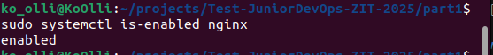
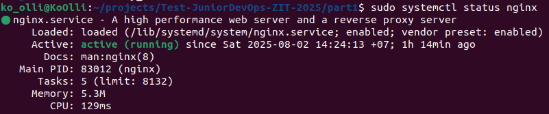
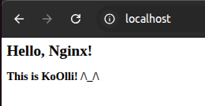

#### Все файлы, о которых идет речь в этом readme, есть в директории part1

#### Установка nginx:  
`sudo apt install nginx`  
- Сразу делаем автозапуск сервера:  
`sudo systemctl enable nginx`  
- Проверяем, выполнив:  
`sudo systemctl is-enabled nginx`  
вывод будет - **enabled**  

или обращаем внимание на **Loaded** при выполнении:  
`sudo systemctl status nginx`  
  
#### Настройка  
- Создаем конфиг в `/etc/nginx/sites-available/my_site.conf`  
- Создаем папку для сайта и страницу  
`sudo mkdir -p /var/www/my_sity`  
записываем в файл **index.html** содержимое страницы  
- Активируем конфиг:  
`sudo ln -s /etc/nginx/sites-available/my_site.conf /etc/nginx/sites-enabled/`  
- Проверяем синтаксис конфига и перезапускаем nginx:  
`sudo nginx -t`  
`sudo systemctl restart nginx`  
- Открываем в браузере  
`http://localhost`  
или  
`curl http://localhost`  
